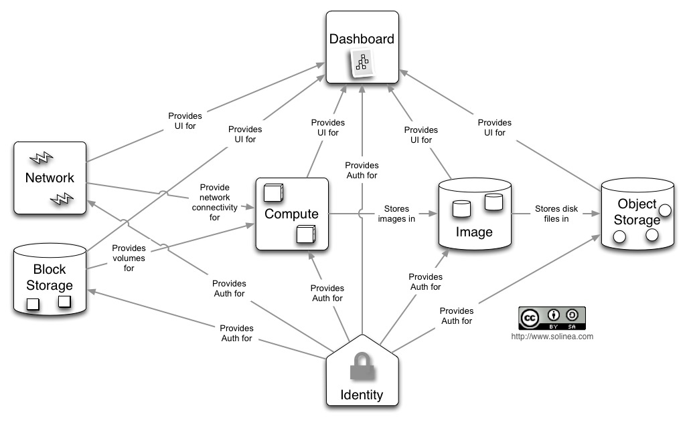
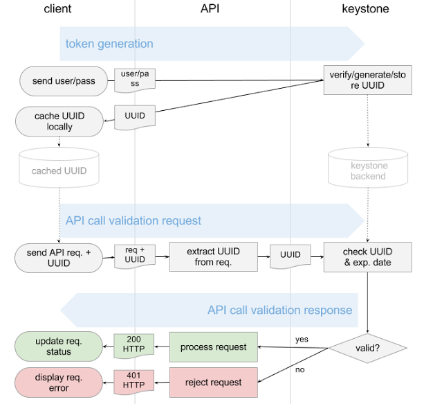

# KeyStone Project#

## Introduction ##
# Open Stack #
> A free and open-source platform for cloud computing deployed on IaaS. Internet as a Service provides infrastructure for the cloud-service model. OpenStack consists of various components like hardware, Storage, Network Resources which are interrelated with each other.
> 
> IaaS, abstracts its features from users by just allowing the access to requested resources. Data partitioning, Scaling, Security, storage (backup), physical location, Physical Computing Resources are all abstracted. Some of the resources provided by IaaS would be 
> 
- Virtual Machine Disk Image library
- Raw block storage
- File/Object storage
- Firewalls
- Load Balancers
- IP address
- VLAN services

> IaaS providers manages multiple VM’s and these guest VM’s spin up/down based on the requirements requested by User. Users will install Operating System image for boot up the VM and all the related patches and maintenance of OS are done by users. All the services provided by Cloud are managed by user either through Web-based dashboard (CLI) or through RESTful-API.

> Services provided by Open stack are categorized as below for various purposes:
> 
- Keystone (as Identity Service)
- NOVA (as Compute)
- Glance (as Image Service)
- Neutron (networking)
- Horizon (Dashboard)
- Cinder (Block Storage)
- Heat (orchestration) and many other

> This report would deal with Keystone (identity Service).

## Keystone

> Keystone provides identity, token, catalog and policy services to be used by various projects in OpenStack. It is a common authentication system for the cloud service which integrates with backend services (example: LDAP). Authentication and Authorization are handled by it. Authentication is handled in different ways.
>  In general scenario
>  
1. Username and password are used as standard credential service.
2. These credentials are authenticated by identity service by generating a Token.
3. This token is sent back to client and a UUID generation takes place.
4. This token is used to establish a session with the OpenStack services and going further a user can directly use this token to login the system instead of making use his credentials.
5. Using this saved token, user can also access his previous environment status.

> Some of the responsibilities that are involved by Keystone development would be:
>  
- Creating OpenStack identity services
- Provides WSGI middleware
- Python Client Library.

> Key stone Functionality (Configuring other services to work with Keystone)
A rough & basic functionality of Keystone and its authentication service is displayed below with keystone middleware architecture. 

> 1. Client makes a call requesting access to the services which will generate a token. The keystone middleware will check for authentication by validating this token. 
If (Authentication Success)
	Successfully bypass the middleware
Else
	Throwback error to User.

> 2. Further, this token is used to bypass the middleware which brings access to various OpenStack projects which your token is assigned to. Here the data is passed to various OpenStack services in Header format generated by middleware. Data here will include (Username, userid, Project Name, Project Id, Roles etc).

## Keystone Middleware (Authentication Middleware)
> This acts as internal API for OpenStack project based on WSGI standard. Since the middleware deals with authentication protocols, some of the possible Authentication protocols here would be
Http basic Authentication
Digest Access
Public Key
Token (Used by OpenStack as Authentication component to show Authentication & Authorization for service).

## Keystone Architecture

## Keystone Services and their interaction
>Keystone service architecture defines various services for various purposes.
Identity Service:
This service is responsible for Authentication of user credentials and also it holds data about users and their associated groups. This is considered to be base case.
Same service when performed from Authoritative backend, then it would be managed by LDAP.

>Resource Service:
Data about projects & domains are provided by this service. This data is managed by this service (or) it can be pulled from another authoritative backend service like LDAP. Whenever the Resource service doesn’t have information of any requested Project/Domain then LDAP would be pointed out to fetch the required data (or) in any problem of such data, Resource service will populate the data from LDAP.

>- Assignment Service:
Identity and Resource service will manage various entities. Roles and their assignments related to these entities are provided by Assignment Service. This service also uses LDAP service in absence of such data.

>- Catalog Service:
In general, a catalog is generated when a temporary token is created for user. It provides an endpoint registry used for end-point discovery.

>- Policy Service:
A rule-based authorization engine and associated Rule management interface is provided by Policy service.

## Keystone Identity Manager 

> **Application Construction:**
> 
Keystone acts as HTTP front-end to OpenStack services. Web-based services are used by users to access the cloud services. Keystone is developed by python WSGI interfaces through which it is communicated and is configured with other services using Python Paste. Each of the application HTTP endpoints are made up of WSGI middleware.

>All these front-end HTTP endpoints are linked to controllers using keystone.common.wsgi.ComposingRouter). Each Controller has at-least one ***Manager*** loaded (which are like wrapper classes) that contain ***appropriate service driver*** based on keystone configuration.

> **Service Backend:**
 
>Each keystone service (like identity, Assignment etc.)  Can be configured to use various backend services to allow keystone to fit to various environments. Keystone.config file maintains all the information regarding these services. Every service will be having a key driver associated. Further, the backend services can be any environments related to Networks, Storage, and Imaging etc.

>Backend Driver associated with each keystone service will provide implementations of how to deal with various environments in the back end.
Some possible backend service would be
>
- SQL backend
- Template backend
- LDAP (Authoritative backend)

>**Keystone Authentication Process State Diagram:**

>**Authentication Policy:**
>
1. Checks whether performing user is an Admin.
2. Check whether performing user matches the user being referenced (Validation process).

## Creating “User – Profile – Role” in Keystone:
>
“keystone-manage bootstrap”, this command is used to create a User, Project, Role in keystone where a “Role is assigned to User on some Project.”  Default Name provided for such creation would be admin.

>Defaults thus provided can be changed using the bootstrap commands (or) environmental equivalent names given to them
>
--bootstrap-username		or	OS_BOOTSTRAP_USERNAME
--bootstrap-project-name	or	OS_BOOTSTRAP_PROJECT_NAME
--bootstrap-role-name		or	OS_BOOTSTRAP_ROLE_NAME
--bootstrap-password		or	OS_BOOTSTRAP_PASSWORD
>
Creating Identity Service:
--bootstrap-public-url
--bootstrap-admin-url
--bootstrap-internal-url

## CLI: 
    catalog                       List service catalog, possibly filtered by service.
    ec2-credentials-create        Create EC2-compatible credentials for user per tenant.
    ec2-credentials-delete        Delete EC2-compatible credentials.
    ec2-credentials-get           Display EC2-compatible credentials.
    ec2-credentials-list          L ist EC2-compatible credentials for a user.
    endpoint-create         	  Create a new endpoint associated with a service.
    endpoint-delete               Delete a service endpoint.
    endpoint-get                  Find endpoint filtered by a specific attribute or service type.
    endpoint-list                 List configured service endpoints.
    password-update               Update own password.
    role-create                   Create new role.
    role-delete                   Delete role.
    role-get                      Display role details.
    role-list                     List all roles.
    service-create                Add service to Service Catalog.
    service-delete                Delete service from Service Catalog.
    service-get                   Display service from Service Catalog.
    service-list                  List all services in Service Catalog.
    tenant-create                 Create new tenant.
    tenant-delete                 Delete tenant.
    tenant-get                    Display tenant details.
    tenant-list                   List all tenants.
    tenant-update                 Update tenant name, description, enabled status.
    token-get                     Display the current user token.
    user-create                   Create new user.
    user-delete                   Delete user.
    user-get                      Display user details.
    user-list                     List users.
    user-password-update          Update user password.
    user-role-add                 Add role to user.
    user-role-list                List roles granted to a user.
    user-role-remove              Remove role from user.
    user-update                   Update user's name, email, and enabled status.
    discover                      Discover Keystone servers, supported API versions and extensions.
    bootstrap                     Grants a new role to a new user on a new tenant, after creating each.
    bash-completion               Prints all of the commands and options to stdout.
    help                          Display help about this program or one of its subcommands.

## Installation:

## References: 

http://docs.openstack.org/cli-reference/openstack.html

http://docs.openstack.org/cli-reference/keystone.html

http://docs.openstack.org/developer/python-keystoneclient/

