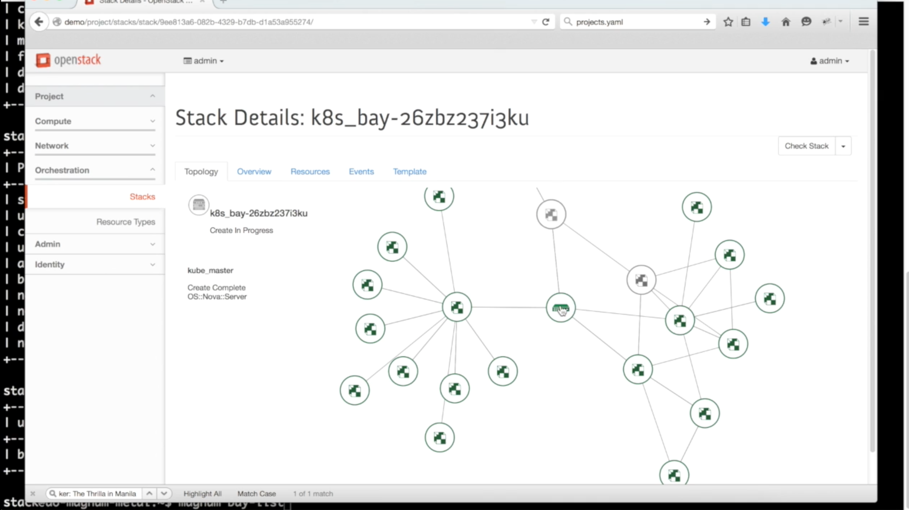

# OpenStack Magnum Project
UTSA OCI - Intel Internship  
Shawn Aten, Annie Lezil, Mohan Muppidi

## 1. Introduction
> Magnum is an OpenStack API service developed by the OpenStack Containers Team making container orchestration engines such as Docker and Kubernetes available as first class resources in OpenStack. Magnum uses Heat to orchestrate an OS image which contains Docker and Kubernetes and runs that image in either virtual machines or bare metal in a cluster configuration.

The usage of containers is rapidly increasing across different fields. Docker is a popular tool that abstracts some aspects of Linux containers. Kubernetes and Swarm are popular tools to orchestrate nodes to run Docker containers. Containers on OpenStack enable denser and more flexible use of resources. Magnum brings containers up as first-class citizens on OpenStack by automating the orchestration of Kubernetes and Swarm clusters.

To accomplish this Magnum uses the standard OpenStack projects (Nova, Neutron, Glance, Cinder) and the Heat orchestration project. Essentially Magnum works at the Heat level to automate the specific use case of creating Kubernetes or Swarm clusters.

### 1.1. Purpose
Magnum provides an API designed to manage app containers. It differs from Nova, Docker, Swarm, or Kubernetes but leverages all as components. It also differs from Nova-Docker or using the Docker resource in Heat directly. Magnum makes Docker containers first-class citizens on OpenStack.

### 1.2. Terms

#### 1.2.1. General

**Container:** An instance of OS-level virtualization with an isolated user-space. Different from a virtual machine as it uses OS resources including the kernel and file system; not as isolated or secure. Different types of Linux containers exist. Magnum uses Docker containers.

**Docker:** A tool that automates and abstracts aspects of Linux containers. Uses features of the Linux kernel including cgroups, namespaces, and union-capable filesystems such as aufs.

**Kubernetes and Swarm:** Orchestration tools for the creation and management of clusters of nodes running Docker Engine. Swarm is developed by Docker and Kubernetes by Google.

#### 1.2.2. Specific to Magnum

**Bay:** A collection of node objects where work is scheduled

**Bay Model:** An object stores template information about the bay which is used to create new bays consistently

#### 1.2.3. Specific to Kubernetes

**Pod:** A collection of containers running on one physical or virtual machine

**Service:** An abstraction which defines a logical set of pods and a policy by which to access them

**Replication Controller:** An abstraction for managing a group of pods to ensure a specified number of resources are running
Container: A Docker container

## 2. Architecture


### 2.1. Components of Magnum
The Magnum project is composed of three main components: magnum-api, magnum-conductor, and python-magnumclient.

The python-magnumclient is similar to the other OpenStack Python clients. It sends requests to the magnum-api REST server. (The magnum-api REST server may run as one or more processes.) Upon receiving requests from clients, it communicates via AMQP to the magnum-conductor process. (Currently magnum-conductor is limited to a single process but is intended to scale in the future.)

### 2.2. OpenStack Components Used by Magnum
Magnum utilizes the typical OpenStack services: Nova, Neutron, Glance, Cinder and one less typical service: Heat.

Heat is an orchestration tool that allows for automating usage of the other OpenStack services. Magnum does not reinvent the wheel with orchestration, it adds another layer on top of Heat to further automate the creation of resources for container usage.


*Screenshot of Kubernetes Heat stack in Horizon.*

### 2.2. Detail of Communication Flow
Clients communicate requests to the magnum-api. The magnum-api sends all requests to magnum-conductor. For example, a request to create a bay will cause magnum-api to communicate with magnum-conductor which then communicates with Heat to create and setup the resources. Then magnum-conductor will communicate with Kubernetes, Swarm, or Docker after setup. For example, if a request comes in to create a Kuberentes pod, magnum-api will communicate with magnum-conductor to send those request to the Kubernetes engine which would then commicate with the Docker engine.

## 3. Installation
Magnum can be installed in DevStack by enabling the plugin in your `local.conf`. `enable_plugin magnum https://git.openstack.org/openstack/magnum` The full details can be found [here](http://docs.openstack.org/developer/magnum/dev/dev-quickstart.html#exercising-the-services-using-devstack) The [Cloud Init](./cloud.init) file in this directory can be used to initialize a cloud machine with DevStack and Magnum.

## 4. CLI
Magnum is used through the *magnum* Python client. To interact with bays (create pods, run containers, etc.) you use the magnum client, not the kubectl or docker-swarm clients. Here's a partial overview of the available commands.

```
baymodel-create     Create a baymodel.
baymodel-delete     Delete specified baymodel.
baymodel-list       Print a list of bay models.
baymodel-show       Show details about the given baymodel.
baymodel-update     Updates one or more baymodel attributes.
bay-create          Create a bay.
bay-delete          Delete specified bay.
bay-list            Print a list of available bays.
bay-show            Show details about the given bay.
bay-update          Update information about the given bay.
ca-show             Show details about the CA certificate for a bay.
ca-sign             Generate the CA certificate for a bay.
container-create    Create a container.
container-delete    Delete specified containers.
container-exec      Execute command in a container.
container-list      Print a list of available containers.
container-logs      Get logs of a container.
container-pause     Pause specified containers.
container-reboot    Reboot specified containers.
container-show      Show details of a container.
container-start     Start specified containers.
container-stop      Stop specified containers.
container-unpause   Unpause specified containers.
service-list        Print a list of magnum services.
pod-create          Create a pod.
pod-delete          Delete specified pod.
pod-list            Print a list of registered pods.
pod-show            Show details about the given pod.
pod-update          Update information about the given pod.
rc-create           Create a replication controller.
rc-delete           Delete specified replication controller.
rc-list             Print a list of registered replication controllers.
rc-show             Show details about the given replication controller.
rc-update           Update information about the given replication
controller.
coe-service-create  Create a coe service.
coe-service-delete  Delete specified coe service.
coe-service-list    Print a list of coe services.
coe-service-show    Show details about the given coe service.
coe-service-update  Update information about the given coe service.
bash-completion     Prints arguments for bash-completion. Prints all of
the commands and options to stdout so that the
magnum.bash_completion script doesn't have to hard
code them.
help                Display help about this program or one of its
subcommands.
```

### 4.1. Creating a Kubernetes Bay

Create a keypair for use with the baymodel:

```
test -f ~/.ssh/id_rsa.pub || ssh-keygen -t rsa -N "" -f ~/.ssh/id_rsa
nova keypair-add --pub-key ~/.ssh/id_rsa.pub testkey
```

Create a baymodel. This is similar in nature to a flavor and describes to magnum how to construct the bay. The coe (Container Orchestration Engine) and keypair need to be specified for the baymodel:

```
magnum baymodel-create --name k8sbaymodel \
  --image-id fedora-21-atomic-5 \
  --keypair-id testkey \
  --external-network-id public \
  --dns-nameserver 8.8.8.8 \
  --flavor-id m1.small \
  --docker-volume-size 5 \
  --network-driver flannel \
  --coe kubernetes
```

Create a bay. Use the baymodel name as a template for bay creation. This bay will result in one master kubernetes node and one minion node:

```
magnum bay-create --name k8sbay --baymodel k8sbaymodel --node-count 1
```

Bays will have an initial status of CREATE_IN_PROGRESS. Magnum will update the status to CREATE_COMPLETE when it is done creating the bay. Do not create containers, pods, services, or replication controllers before magnum finishes creating the bay. They will likely not be created, and may cause magnum to become confused.

The existing bays can be listed as follows:

```
magnum bay-list

+--------------------------------------+---------+------------+-----------------+
| uuid                                 | name    | node_count | status          |
+--------------------------------------+---------+------------+-----------------+
| 9dccb1e6-02dc-4e2b-b897-10656c5339ce | k8sbay  | 1          | CREATE_COMPLETE |
+--------------------------------------+---------+------------+-----------------+
```

More detailed information for a given bay is obtained via:

```
magnum bay-show k8sbay
```

After a bay is created, you can dynamically add/remove node(s) to/from the bay by updating the node_count attribute. For example, to add one more node:

```
magnum bay-update k8sbay replace node_count=2
```

Bays in the process of updating will have a status of UPDATE_IN_PROGRESS. Magnum will update the status to UPDATE_COMPLETE when it is done updating the bay.

NOTE: Reducing node_count will remove all the existing pods on the nodes that are deleted. If you choose to reduce the node_count, magnum will first try to remove empty nodes with no pods running on them. If you reduce node_count by more than the number of empty nodes, magnum must remove nodes that have running pods on them. This action will delete those pods. We strongly recommend using a replication controller before reducing the node_count so any removed pods can be automatically recovered on your remaining nodes.

Heat can be used to see detailed information on the status of a stack or specific bay:

To check the list of all bay stacks:

```
heat stack-list
```

To check an individual bay’s stack:

```
heat stack-show <stack-name or stack_id>
```

Monitoring bay status in detail (e.g., creating, updating):

```
BAY_HEAT_NAME=$(heat stack-list | awk "/\sk8sbay-/{print \$4}")
echo ${BAY_HEAT_NAME}
heat resource-list ${BAY_HEAT_NAME}
```

### 4.2. Using Kubernetes Bay

NOTE: For the following examples, only one minion node is required in the k8s bay created previously.

Kubernetes provides a number of examples you can use to check that things are working. You may need to clone kubernetes using:

```
wget https://github.com/kubernetes/kubernetes/releases/download/v1.0.1/kubernetes.tar.gz
tar -xvzf kubernetes.tar.gz
```

NOTE: We do not need to install Kubernetes, we just need the example file from the tarball.

Here’s how to set up the replicated redis example. First, create a pod for the redis-master:

```
cd kubernetes/examples/redis
magnum pod-create --manifest ./redis-master.yaml --bay k8sbay
```

Now create a service to provide a discoverable endpoint for the redis sentinels in the cluster:

```
magnum coe-service-create --manifest ./redis-sentinel-service.yaml --bay k8sbay
```

To make it a replicated redis cluster create replication controllers for the redis slaves and sentinels:

```
sed -i 's/\(replicas: \)1/\1 2/' redis-controller.yaml
magnum rc-create --manifest ./redis-controller.yaml --bay k8sbay

sed -i 's/\(replicas: \)1/\1 2/' redis-sentinel-controller.yaml
magnum rc-create --manifest ./redis-sentinel-controller.yaml --bay k8sbay
```

Full lifecycle and introspection operations for each object are supported. For example, magnum bay-create, magnum baymodel-delete, magnum rc-show, magnum coe-service-list.

Now there are four redis instances (one master and three slaves) running across the bay, replicating data between one another.

Run the bay-show command to get the IP of the bay host on which the redis-master is running:

```
magnum bay-show k8sbay

+--------------------+------------------------------------------------------------+
| Property           | Value                                                      |
+--------------------+------------------------------------------------------------+
| status             | CREATE_COMPLETE                                            |
| uuid               | 481685d2-bc16-4daf-9aac-9e830c7da3f7                       |
| status_reason      | Stack CREATE completed successfully                        |
| created_at         | 2015-09-22T20:02:39+00:00                                  |
| updated_at         | 2015-09-22T20:05:00+00:00                                  |
| bay_create_timeout | 0                                                          |
| api_address        | 192.168.19.84:8080                                         |
| baymodel_id        | 194a4b7e-0125-4956-8660-7551469ae1ed                       |
| node_count         | 1                                                          |
| node_addresses     | [u'192.168.19.86']                                         |
| master_count       | 1                                                          |
| discovery_url      | https://discovery.etcd.io/373452625d4f52263904584b9d3616b1 |
| name               | k8sbay                                                     |
+--------------------+------------------------------------------------------------+
```

The output here indicates the redis-master is running on the bay host with IP address 192.168.19.86. To access the redis master:

```
ssh minion@192.168.19.86
REDIS_ID=$(sudo docker ps | grep redis:v1 | grep k8s_master | awk '{print $1}')
sudo docker exec -i -t $REDIS_ID redis-cli

127.0.0.1:6379> set replication:test true
OK
^D

exit  # Log out of the host
```

Log into one of the other container hosts and access a redis slave from it. You can use nova list to enumerate the kube-minions. For this example we will use the same host as above:

```
ssh minion@192.168.19.86
REDIS_ID=$(sudo docker ps | grep redis:v1 | grep k8s_redis | awk '{print $1}')
sudo docker exec -i -t $REDIS_ID redis-cli

127.0.0.1:6379> get replication:test
"true"
^D

exit  # Log out of the host
```

Additional useful commands from a given minion:

```
sudo docker ps  # View Docker containers on this minion
kubectl get po  # Get pods
kubectl get rc  # Get replication controllers
kubectl get svc  # Get services
kubectl get nodes  # Get nodes
```

After you finish using the bay, you want to delete it. A bay can be deleted as follows:

```
magnum bay-delete k8sbay
```

## 5. Code Review

## 6. Code Contribution
```
magnum/
|-- contrib
|   `-- templates
|       `-- example
|           `-- example_template
|-- devstack
|   `-- lib
|-- doc
|   `-- source
|       |-- dev
|       `-- images
|-- etc
|   `-- magnum
|-- magnum
|   |-- api
|   |   |-- controllers
|   |   |   `-- v1
|   |   `-- middleware
|   |-- cmd
|   |-- common
|   |   |-- cert_manager
|   |   |-- pythonk8sclient
|   |   |   |-- swagger_client
|   |   |   |   |-- apis
|   |   |   |   `-- models
|   |   |   `-- templates
|   |   `-- x509
|   |-- conductor
|   |   |-- handlers
|   |   |   `-- common
|   |   `-- tasks
|   |-- db
|   |   `-- sqlalchemy
|   |       `-- alembic
|   |           `-- versions
|   |-- hacking
|   |-- locale
|   |   `-- ja
|   |       `-- LC_MESSAGES
|   |-- objects
|   |-- public
|   |   `-- css
|   |-- service
|   |-- servicegroup
|   |-- templates
|   |   |-- kubernetes
|   |   |   |-- elements
|   |   |   |   `-- kubernetes
|   |   |   `-- fragments
|   |   |-- mesos
|   |   |   |-- elements
|   |   |   |   |-- docker
|   |   |   |   |   |-- post-install.d
|   |   |   |   |   `-- pre-install.d
|   |   |   |   `-- mesos
|   |   |   |       |-- post-install.d
|   |   |   |       `-- pre-install.d
|   |   |   `-- fragments
|   |   `-- swarm
|   |       `-- fragments
|   `-- tests
|       |-- contrib
|       |-- functional
|       |   |-- api
|       |   |   `-- v1
|       |   |       |-- clients
|       |   |       `-- models
|       |   |-- common
|       |   |-- k8s
|       |   |-- mesos
|       |   |-- swarm
|       |   `-- tempest_tests
|       `-- unit
|           |-- api
|           |   `-- controllers
|           |       `-- v1
|           |-- common
|           |   |-- cert_manager
|           |   `-- x509
|           |-- conductor
|           |   |-- handlers
|           |   |   `-- common
|           |   `-- tasks
|           |-- db
|           |   `-- sqlalchemy
|           |-- objects
|           |-- service
|           |-- servicegroup
|           `-- template
|-- specs
`-- tools
```

## 7. References
<https://wiki.openstack.org/wiki/Magnum>    
<http://docs.openstack.org/developer/magnum/dev/quickstart.html#building-a-kubernetes-bay-based-on-fedora-atomic>
<http://docs.openstack.org/developer/magnum/dev/dev-quickstart.html#using-kubernetes-bay>
<https://en.wikipedia.org/wiki/Operating-system-level_virtualization>
<https://en.wikipedia.org/wiki/Docker_(software)>
<http://docs.openstack.org/developer/magnum/#architecture>
