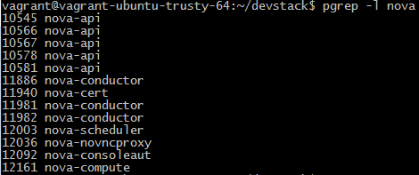

**Abstract-**  This project addresses our need to learn about the Nova service in OpenStack in order to make code contributions.  The first four sections of this project demonstrate our understanding of how Nova operates and communicates with the other services within OpenStack on a conceptional level.  The last two sections demonstrate our understanding of how Nova has been implemented in code.  This abstract will be updated once we have made a decision as to how to modify the functionality of Nova to suit our needs.

## Outline ##
- 1) Introduction
- 2) Architecture
	- 2.1) Interactions with other OpenStack Services
		- 2.1.1) Glance
- 3) Installation
	- 3.1) Installing Nova from DevStack Source
	- 3.2) Installing Nova from Packages 
- 4) CLI
  - 4.1) Managing Nova
  - 4.2) Managing Instances
  - 4.3) Accessing Instances
- 5) Definitions
- 6) Code Review
- 7) Code Contribution
- 8) References

## 1. Introduction ##

Nova is all about access to compute resources.  

Nova is used for hosting and managing cloud computing systems.  It is a component based architecture enabling quicker additions of new features.  It is scalable, on-demand, fault tolerant, recoverable and provides API-compatibility with systems like Amazon EC2.  Nova provides compute resources such as virtual machines, containers, and bare metal servers.

Nova is built on a messaging architecture.  All of its components can typically be run on several servers.  This architecture allows the components to communicate through a message queue. Deferred objects are used to avoid blocking while a component waits in the message queue for a response.

As the most distributed component in the OpenStack platform, Nova interacts heavily with other OpenStack services like Keystone for performing authentication, Horizon for its Web interface and Glance for supplying its images.

## 2. Architecture ##

**Messaging**

**Scheduler**

**Compute**

Compute manages communication with hypervisors and virtual machines.  You can create compute nodes that will receive requests from the controller node and virtual machine instances.  The compute service relies on a hypervisor to run virtual machine instances.  OpenStack can use a number of various hypervisors such as Docker, KVM or QEMU.

The basics:  Compute will accept actions from the queue and then perform a series of system commands and carry them out while updating status in the database.

While all services are designed to be horizontally scalable, you should have significantly more computes then anything else.

**Conductor**

**SQL Database**

The Nova DB stores the current state of all objects in the compute cluster.  It can be done with any relational database - like MySQL or Postgre.  The Nova API talks to the database via SQLAlchemy which is a python Object Relational Mapper.

### 2.1  Interactions with other OpenStack Services ###

#### 2.1.1  Glance ####

Nova's most important interactions are with the Glance service.  Glance is responsible for the management and retrieval of virtual machine images.  While Glance itself does not store the images, it is a necessary layer of abstraction which provides all of the necessary data in order for Nova to start the virtual machine.  Glance allows users to create and list available images, which are fed into Nova to be executed.  When a user creates a snapshot of their virtual machine, they have actually created a new image.  Glance will add the new image to its database and storage back end.

#### 2.1.2  Keystone ####

Nova interacts with Keystone to perform authentication.  For instance, if a user wanted to create a new instance, Nova would need to send a request to Keystone with the user's password and username.  Keystone would then reply to Nova with a Token assuming the credentials were valid.  Nova will then use this token when it performs tasks by sending it to Keystone for validation.  In our example, if the token is valid, Nova can continue with making the  user's instance.  Tokens are valid for one hour by default.

## 3. Installation ##

This installation guide is for OpenStack "**Liberty**" on **Ubuntu 14.04**

###3.1  Installing Nova via DevStack Source###

1)  Install essential software

    $ sudo apt-get update
    $ sudo apt-get install -y git python-pip vim
 
2)  Pull DevStack source from the Git repository

    $ git clone https://git.openstack.org/openstack-dev/devstack

3)  Create a local configuration file in devstack/local.conf, below is an example configuration

    [[local|localrc]]
    ADMIN_PASSWORD=secrete
    DATABASE_PASSWORD=$ADMIN_PASSWORD
    RABBIT_PASSWORD=$ADMIN_PASSWORD
    SERVICE_PASSWORD=$ADMIN_PASSWORD
    SERVICE_TOKEN=a682f596-76f3-11e3-b3b2-e716f9080d50
    GIT_BASE=https://git.openstack.org
    disable_service n-net
    enable_service q-svc
    enable_service q-agt
    enable_service q-dhcp
    enable_service q-l3
    enable_service q-meta
    enable_service neutron

4)  Run the DevStack setup script, it will take a few minutes to complete

    $ sudo devstack/stack.sh

###3.2  Installing Nova via Packages###

1)  Install Necessary OpenStack Components

- 1.1  [Install OpenStack packages](http://docs.openstack.org/liberty/install-guide-ubuntu/environment-packages.html "Install Openstack packages")

- 1.2  [Install MySQL Database](http://docs.openstack.org/liberty/install-guide-ubuntu/environment-sql-database.html "Install MySQL Database")

- 1.3  [Install RabbitMQ](http://docs.openstack.org/liberty/install-guide-ubuntu/environment-messaging.html "Install RabbitMQ")

- 1.4  [Install Keystone](http://docs.openstack.org/liberty/install-guide-ubuntu/keystone.html "Install Keystone")

- 1.5  [Install Glance](http://docs.openstack.org/liberty/install-guide-ubuntu/glance.html "Install Glance")

- 1.6  [Install Neutron](http://docs.openstack.org/liberty/install-guide-ubuntu/neutron.html "Install Neutron")

2)  Install Nova from Package Manager

    $ sudo apt-get install -y nova-api nova-scheduler nova-conductor nova-cert nova-consoleauth nova-novncproxy nova-compute

3)  Verify that the host machine supports KVM extensions, which are necessary to use the KVM hypervisor.  If the host machine **DOES NOT** support KVM extensions, skip to step 4.

    $ sudo kvm-ok

4)  Verify that the KVM kernel modules are loaded, this only applies to hosts that support KVM extensions.  If the host **DOES** support KVM extensions, skip to step 5.

    $ sudo modprobe kvm
    $ sudo modprobe kvm_intel
    $ cat <<EOF | sudo tee -a /etc/modules
      kvm
      kvm_intel
      EOF

5)  Install QEMU, only applies to hosts that **DO NOT** support KVM extensions

    $ sudo apt-get install -y nova-compute-qemu

6)  Stop Nova's services

    $ sudo service nova-api stop
    $ sudo service nova-scheduler stop
    $ sudo service nova-conductor stop
    $ sudo service nova-cert stop
    $ sudo service nova-consoleauth stop
    $ sudo service nova-novncproxy stop
    $ sudo service nova-compute stop

7) Use "myadmin" credentials
    $ source ~/credentials/myadmin

8) Create a user for the Nova service
    $ openstack user create --password notnova nova

9) Grant the "admin" role to the new user
    $ openstack role add --project Service --user nova admin

10) Add the Nova service to the service catalog
    $ openstack service create --name nova --description "OpenStack Compute" compute
  
11) Populate compute endpoints in service catalog
    $ openstack endpoint create --region RegionOne --publicurl http://$MY_PUBLIC_IP:8774/v2/%\(tenant_id\)s --internalurl http://$MY_PRIVATE_IP:8774/v2/%\(tenant_id\)s --adminurl http://$MY_PRIVATE_IP:8774/v2/%\(tenant_id\)s compute

12) Verify that the Nova service and endpoints were added to the Service Catalog
    $ openstack catalog list

13) Configure Nova

    Configure Nova
    cat <<EOF | sudo tee /etc/nova/nova.conf
    [DEFAULT]
    dhcpbridge_flagfile=/etc/nova/nova.conf
    dhcpbridge=/usr/bin/nova-dhcpbridge
    logdir=/var/log/nova
    state_path=/var/lib/nova
    lock_path=/var/lock/nova
    force_dhcp_release=True
    libvirt_use_virtio_for_bridges=True
    verbose=True
    ec2_private_dns_show_ip=True
    api_paste_config=/etc/nova/api-paste.ini
    enabled_apis=osapi_compute,metadata
    rpc_backend = rabbit
    auth_strategy = keystone
    my_ip = $MY_IP
    network_api_class = nova.network.neutronv2.api.API
    security_group_api = neutron
    linuxnet_interface_driver = nova.network.linux_net.NeutronLinuxBridgeInterfaceDriver
    firewall_driver = nova.virt.firewall.NoopFirewallDriver
    force_config_drive = True

    [database]
    connection = mysql+pymysql://nova:notnova@$MY_IP/nova

    [glance]
    host = $MY_IP

    [keystone_authtoken]
    auth_uri = http://$MY_IP:5000
    auth_url = http://$MY_IP:35357
    auth_plugin = password
    project_domain_id = default
    user_domain_id = default
    project_name = Service
    username = nova
    password = notnova

    [neutron]
    url = http://$MY_PRIVATE_IP:9696
    auth_url = http://$MY_PRIVATE_IP:35357
    auth_plugin = password
    project_domain_id = default
    user_domain_id = default
    region_name = RegionOne
    project_name = service
    username = neutron
    password = notneutron
    service_metadata_proxy = True
    metadata_proxy_shared_secret = openstack

    [cinder]
    os_region_name = RegionOne

    [oslo_concurrency]
    lock_path = /var/lib/nova/tmp

    [oslo_messaging_rabbit]
    rabbit_host = $MY_IP
    rabbit_userid = openstack
    rabbit_password = notopenstack

    [vnc]
    enabled = True
    vncserver_listen = 0.0.0.0
    vncserver_listen = $MY_IP
    vncserver_proxyclient_address = $MY_IP
    novncproxy_base_url = http://$MY_PUBLIC_IP:6080/vnc_auto.html
    EOF

14) Initialize the Nova database
    $ sudo nova-manage db sync

15) Start Nova's services
    $ sudo service nova-api start
    $ sudo service nova-scheduler start
    $ sudo service nova-conductor start
    $ sudo service nova-cert start
    $ sudo service nova-consoleauth start
    $ sudo service nova-novncproxy start
    $ sudo service nova-compute start

16) Verify that Nova is running
    $ pgrep -l nova

17) Verify that the Nova services are enabled and operational
    $ nova service-list

## 4. CLI ##

### 4.1 Managing Nova ###

**List all running instances**
    
    $ nova list

**List all available images**  (e.g. Different Operating Systems)

    $ nova image-list

**List all available flavors**  (e.g. Different virtual machine configurations)

    $ nova flavor-list

### 4.2 Managing Instances ###

**Creating a new instance with optional user data** 

Automatically powers on the instance after creation, injected files will be located at /var/lib/cloud

    $ nova boot --image [image name] --flavor [flavor id] (--user-data [paths to files]) [new instance name]
    
    Example:  nova boot --flavor 1 --image cirros-0.3.4-x86_64-uec TestInstance1
	          nova boot --flavor 1 --image cirros-0.3.4-x86_64-uec --user-data /home/user/userdata.txt TestInstance1

**View the details of an instance**

    $ nova show [name of instance]

    Example:  nova show TestInstance1

**Rescuing an instance** 

Uses an emergency boot disk in case the instance has been rendered unbootable

    $ nova rescue [name of instance]

    Example:  nova rescue TestInstance1

**Pausing an instance** 

Instance state remains in memory

    $ nova pause [name of instance]

    Example:  nova pause TestInstance1

**Unpausing an instance**

    $ nova unpause [name of instance]

    Example:  nova unpause TestInstance1

**Suspending an instance** 

Instance state is stored to disk

    $ nova suspend [name of instance]

    Example:  nova suspend TestInstance1

**Resuming a suspended instance**

    $ nova resume [name of instance]

    Example:  nova resume TestInstance1

**Powering off an instance**

    $ nova stop [name of instance]

    Example:  nova stop TestInstance1

**Powering on an instance**

    $ nova start [name of instance]

    Example:  nova start TestInstance1

**Rebooting an instance** 

Equivalent to nova stop, then nova start

    $ nova reboot [name of instance]

    Example:  nova reboot TestInstance1

**Changing and instance's flavor** 

Changes the resources available e.g. cpu, ram, etc.

    $ nova resize [name of instance] [flavor id]
    $ nova resize-confirm [name of instance]

    Example:  nova resize TestInstance1 2
              nova resize-confirm TestInstance1

**Rebuilding an instance** 

Reconstructs the image using a new image while maintaining its other properties

    $ nova rebuild [name of instance] [image name]

    Example:  nova rebuild TestInstance1 cirros-0.3.4-x86_64-uec

### 4.3 Accessing Instances ###

**View the console log of an instance**

    $ nova console-log [name of instance]

    Example:  nova console-log TestInstance1

**Connecting to an instance via SSH**

1)  Retrieve the NETNS_NAME
    
    $ ip netns

2)  Connect via SSH

    $ ip netns exec [NETNS_NAME] ssh -i test.pem [username]@[instance ip]

    Example:  ip netns exec qdhcp-0ffaa6c5-4fe3-4758-9b67-5bbe558f7c15 ssh cirros@10.0.0.4

**SSH Key Injection** (requires a new instance)

1)  Create a keypair

    $ nova keypair-add test > test.pem

    $ chmod 600 test.pem

2)  Create a new instance with --key_name option
  
    $ nova boot --image [image name] --flavor [flavor id] --key_name test [name of instance]

3)  Connect via SSH with the keypair

    $ ip netns exec [NETNS_NAME] ssh -i test.pem [username]@[instance ip]
    
    Example:  ip netns exec qdhcp-0ffaa6c5-4fe3-4758-9b67-5bbe558f7c15 ssh -i test.pem cirros@10.0.0.4

## 5. Definitions ##

**Bare metal Server** - A bare metal environment is a computer system or network in which a virtual machine is installed directly on hardware rather than within the host operating system (OS). The term "bare metal" refers to a hard disk, the usual medium on which a computer's OS is installed.

**Container** - Container-based virtualization, also called operating system virtualization, is an approach to virtualization in which the virtualization layer runs as an application within the operating system (OS). In this approach, the operating system's kernel runs on the hardware node with several isolated guest virtual machines (VMs) installed on top of it. The isolated guests are called containers. 

**Fault tolerance** - Fault tolerance is the property that enables a system to continue operating properly in the event of the failure of (or one or more faults within) some of its components.

## 6. Code Review ##

## 7. Code Contribution ##

## 8. References ##

[Introduction - Webopedia](http://www.webopedia.com/TERM/O/openstack-nova.html)

[Introduction - OpenStack](http://docs.openstack.org/developer/nova/project_scope.html)

[Introduction - Jenkov](http://tutorials.jenkov.com/jquery/deferred-objects.html)

[http://docs.openstack.org/developer/devstack/](http://docs.openstack.org/developer/devstack/)

[http://docs.openstack.org/user-guide/cli_cheat_sheet.html](http://docs.openstack.org/user-guide/cli_cheat_sheet.html)

[http://docs.openstack.org/liberty/install-guide-ubuntu/](http://docs.openstack.org/liberty/install-guide-ubuntu/)

[http://www.ibm.com/developerworks/cloud/library/cl-openstack-nova-glance/](http://www.ibm.com/developerworks/cloud/library/cl-openstack-nova-glance/)

[Compute Node](http://blog.flux7.com/blogs/openstack/tutorial-what-is-nova-and-how-to-install-use-it-openstack)

[Compute Node](http://ken.pepple.info/openstack/2011/04/22/openstack-nova-architecture/)

[Bare metal server](http://searchservervirtualization.techtarget.com/definition/bare-metal-environment)

[Container](http://searchservervirtualization.techtarget.com/definition/container-based-virtualization-operating-system-level-virtualization)

[Fault tolerance](https://en.wikipedia.org/wiki/Fault_tolerance)

[Nova DB](http://www.slideshare.net/mirantis/openstack-architecture-43160012)

[Keystone Interaction](http://essentials.cloudtrain.me/)

[Keystone Token](http://docs.openstack.org/liberty/config-reference/content/keystone-configuration-file.html)
